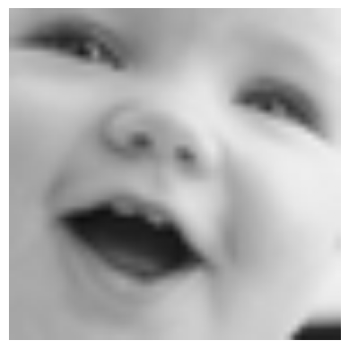
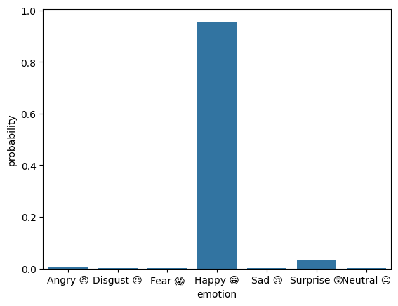
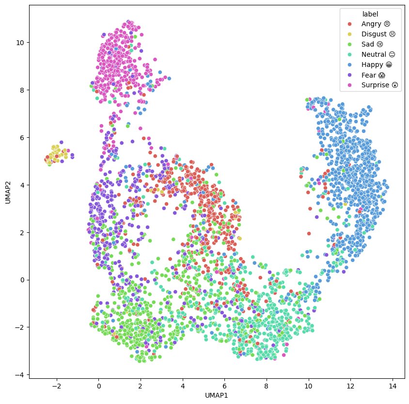

[](https://face2emoji.streamlit.app/)

# Face2Emoji

- The model is trained on the FER2013 dataset which consists of 48x48 pixel grayscale images of faces (approximately 30,000 images, with 7 emotions).
- The model is able to predict the relevant emoji for the given facial expression in the image.

## 📦 Installation
To install the required packages, run the following command:
```bash
pip install -r requirements.txt
```

## 📚 Dataset
Dataset used for training the model is [FER2013 dataset](https://huggingface.co/spaces/mxz/emtion/blob/c697775e0adc35a9cec32bd4d3484b5f5a263748/fer2013.csv). The dataset contains approx. 30,000 images that are each annotated with one of 7 emotions (0=Angry, 1=Disgust, 2=Fear, 3=Happy, 4=Sad, 5=Surprise, 6=Neutral).
Training pipeline expects the dataset to be in the following structure:
```bash
root
└── dataset
        └── fer2013.csv
        
```
You can download the dataset using the following command:
```bash
wget -P ./dataset https://huggingface.co/spaces/mxz/emtion/resolve/c697775e0adc35a9cec32bd4d3484b5f5a263748/fer2013.csv
```

## 🤖 Model & Fine-tuning
The model is [Vision Transformer (ViT)](https://huggingface.co/google/vit-base-patch16-224-in21k) which is a transformer model that performs very well on image classification tasks.  
The pre-trained model from 🤗 Hugging Face can be fine-tuned on the FER2013 dataset using Low-Rank Adaption (LoRA).  
LoRA is a technique that fine-tunes a pre-trained model by adding a small trainable weight matrix, while keeping the original model weights frozen.

Comparison of each method's performance is shown below:
| Method | Trainable Params | VRAM | Batch Size | Epoch | val_acc | lr | 
| ---- | ---- | ---- | ---- | ---- | ---- | ---- | 
| LoRA | 1.3 M (1.52 %) | 1.5 GB | 16 | 9 epochs | 71.22 % | 1e-3 | 
| FT (Normal Fine-tuning) | 85.8 M (100 %) | 4 GB | 16 | 6 epochs | 71.89% | 2e-5 |

In summary, the LoRA method utilizes 1/3 of the VRAM compared to the FT method. Although it exhibits slightly lower validation accuracy, it represents a favorable trade-off between the number of parameters and validation accuracy.

You can download the fine-tuned model (FT) [here](https://huggingface.co/yosshstd/vit-fer2013) and the LoRA adapter [here](https://huggingface.co/yosshstd/vit-lora-fer2013).


## ⏳️ Inference

### Input: Image of a face

<p align="center">
  
</p>

### Output: Probs of each emotion

<p align="center">
  
</p>

## 🗺️ Emotion feature space visualization

- The ViT embeddings of the test images in the FER2013 dataset are dimensionally reduced to 2D using UMAP and visualized in a scatter plot. 
- The plot shows that the embeddings of the images annotated with the same emotion are clustered together, which indicates that the model has learned to represent the emotions in a meaningful way.

<p align="center">
  
</p>

## 📝 Refferences
- [Vision Transformer (ViT)](https://arxiv.org/abs/2010.11929)
- [Low-Rank Adaption (LoRA)](https://arxiv.org/abs/2106.09685)
- [FER2013 dataset](https://paperswithcode.com/dataset/fer2013)
- [Hugging Face](https://huggingface.co/)
- [Streamlit](https://streamlit.io/)
- [UMAP](https://arxiv.org/abs/1802.03426)